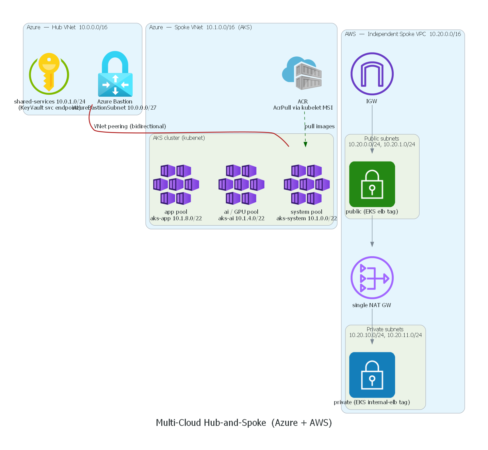
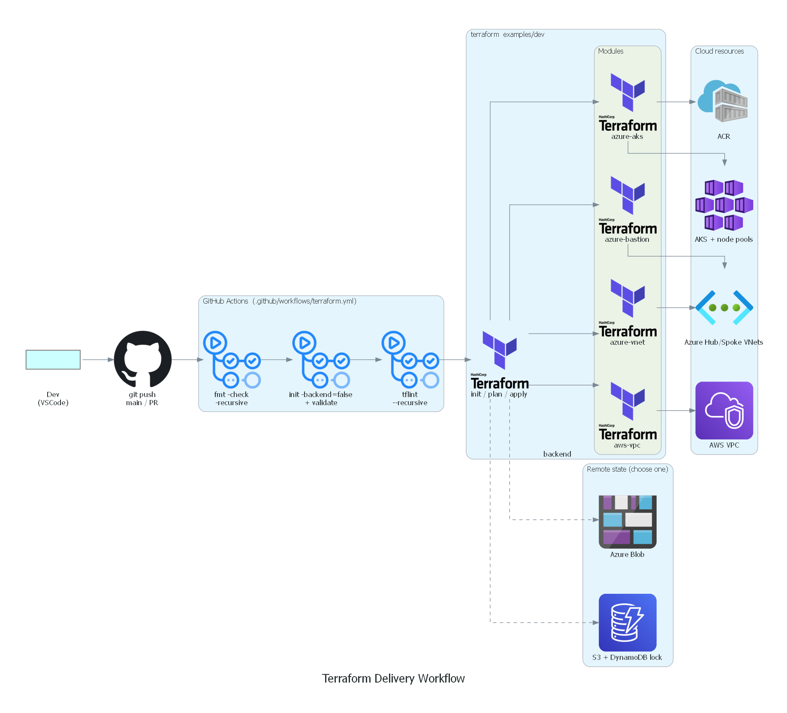
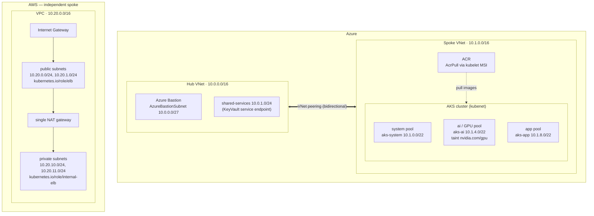
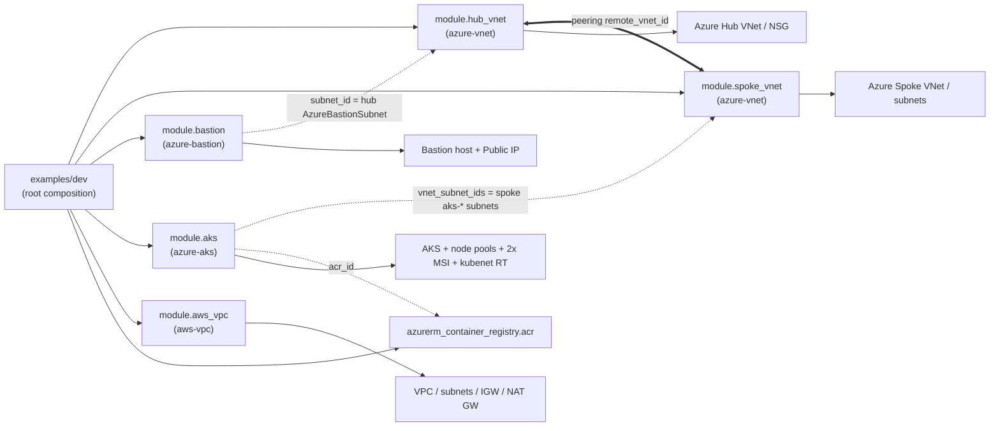
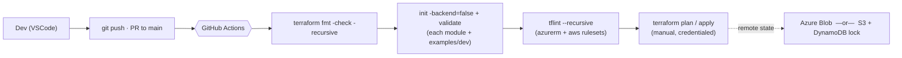

# Architecture — Multi-Cloud Hub-and-Spoke

Deep-dive companion to the [root README](../README.md). Every diagram and value
below is derived directly from the Terraform under `modules/` and
`examples/dev/` — no aspirational topology.

Author: **Md Irshad — Senior Cloud & AI Platform Engineer**

---

## Rendered diagrams

> Regenerate with `make diagrams` (Python + Graphviz). A live Terraform resource
> graph (`docs/diagrams/tf-graph.png`) is produced by `make graph`.

---

## (a) Network architecture

The Azure hub and AKS spoke are peered **bidirectionally**
(`hub-to-spoke` with `allow_gateway_transit = true`; `spoke-to-hub` with
`use_remote_gateways = false`). The AWS VPC is an **independent** spoke
provisioned from the same root plan — there is intentionally no cross-cloud
VPN/peering (out of scope).

---

## (b) Module dependency graph

Key wiring (from `examples/dev/main.tf`):

- `module.bastion.subnet_id` = `module.hub_vnet.subnet_ids["AzureBastionSubnet"]`
- `module.aks.vnet_subnet_ids` = the spoke `aks-system` / `aks-ai` / `aks-app` subnets (index 0/1/2)
- `module.aks.acr_id` = `azurerm_container_registry.acr.id`
- each `azure-vnet` peering references the other VNet's `vnet_id`

---

## (c) CI/CD workflow

Defined in [`.github/workflows/terraform.yml`](../.github/workflows/terraform.yml)
— no cloud credentials required for the CI path (`fmt` / `validate` / `tflint`).

---

## (d) Network topology / CIDR map

| Cloud | Network | CIDR | Subnet | CIDR | Purpose |
|-------|---------|------|--------|------|---------|
| Azure | Hub VNet | `10.0.0.0/16` | `AzureBastionSubnet` | `10.0.0.0/27` | Azure Bastion host |
| Azure | Hub VNet | `10.0.0.0/16` | `shared-services` | `10.0.1.0/24` | KeyVault service endpoint |
| Azure | Spoke VNet | `10.1.0.0/16` | `aks-system` | `10.1.0.0/22` | AKS system pool (subnet 0) |
| Azure | Spoke VNet | `10.1.0.0/16` | `aks-ai` | `10.1.4.0/22` | AKS ai / GPU pool (subnet 1) |
| Azure | Spoke VNet | `10.1.0.0/16` | `aks-app` | `10.1.8.0/22` | AKS app pool (subnet 2) |
| AWS | VPC | `10.20.0.0/16` | public ×2 | `10.20.0.0/24`, `10.20.1.0/24` | IGW-routed, `role/elb` tag |
| AWS | VPC | `10.20.0.0/16` | private ×2 | `10.20.10.0/24`, `10.20.11.0/24` | NAT-routed, `role/internal-elb` tag |

---

## Per-module reference

### `azure-vnet`
- **Creates:** `azurerm_virtual_network`, a map-driven set of `azurerm_subnet`,
  a shared workload `azurerm_network_security_group` + `azurerm_network_security_rule`,
  subnet↔NSG associations, and `azurerm_virtual_network_peering`.
- **Notable:** `AzureBastionSubnet` / `GatewaySubnet` are excluded from the NSG
  association (Azure rejects restrictive NSGs on reserved subnets). Subnets and
  peerings are driven by `subnets` / `peerings` map inputs.

### `azure-aks`
- **Creates:** `azurerm_kubernetes_cluster` (kubenet), an `extra` node-pool
  resource driven by the `node_pools` map, **two** user-assigned identities
  (control-plane + kubelet), `Managed Identity Operator` + `AcrPull` role
  assignments, and a shared kubenet `azurerm_route_table` associated with every
  AKS subnet.
- **Node pools:** `system` (D4s_v5), `ai` (NC4as_T4_v3, GPU, `nvidia.com/gpu`
  taint), `app` (D8s_v5) — mapped to subnet indexes 0/1/2.
- **Zero-credential pulls:** kubelet MSI holds `AcrPull` on the ACR.

### `azure-bastion`
- **Creates:** `azurerm_bastion_host` + a static Standard `azurerm_public_ip`,
  attached to the hub `AzureBastionSubnet`.

### `aws-vpc`
- **Creates:** `aws_vpc`, map-driven public/private `aws_subnet`,
  `aws_internet_gateway`, public/private route tables + routes, and a **single**
  `aws_nat_gateway` (+ EIP) for cost-conscious private egress.
- **EKS-ready:** public subnets tagged `kubernetes.io/role/elb`, private subnets
  `kubernetes.io/role/internal-elb`.

---

## What this demonstrates

- **Hub-and-spoke** network segmentation with bidirectional VNet peering.
- **Multi-cloud** delivery (Azure + AWS) from a single Terraform root.
- **Reusable, map-driven modules** — subnets and node pools change by editing a
  map, never the module body.
- **MSI / ACR RBAC** — no long-lived registry credentials.
- **Remote state** — Azure Blob or S3 + DynamoDB backend templates.
- **Policy as code** — `tflint` (azurerm + aws rulesets) in CI.
